# 🏥 ClinicConnect

Doctor Appointment Booking Website that allows patients to seamlessly schedule, manage, and track their medical appointments. To enhance user experience, I integrated AI-powered assistance using the Vercel AI SDK and Google’s Gemini 2.0 Flash model. The AI provides smart suggestions, answers patient queries, and simplifies the booking process with natural language interactions.
This project helped me explore how AI can transform healthcare workflows, making doctor-patient interactions more accessible and efficient.

## 📋 Table of Contents

- [🌟 Features](#-features)
  - [For Patients](#for-patients)
  - [For Doctors](#for-doctors)
  - [For Administrators](#for-administrators)
  - [AI Integration](#ai-integration)
- [🛠️ Technology Stack](#️-technology-stack)
  - [Frontend](#frontend)
  - [Backend](#backend)
  - [AI & External Services](#ai--external-services)
- [📁 Project Structure](#-project-structure)
- [🚀 Getting Started](#-getting-started)
  - [Prerequisites](#prerequisites)
  - [Installation](#installation)
  - [Running the Application](#running-the-application)
- [📚 API Endpoints](#-api-endpoints)
  - [User Routes](#user-routes-apiuser)
  - [Doctor Routes](#doctor-routes-apidoctor)
  - [Admin Routes](#admin-routes-apiadmin)
  - [AI Routes](#ai-routes-apiai)
- [🤖 AI Chatbot Features](#-ai-chatbot-features)
- [🎨 UI/UX Features](#-uiux-features)
- [🔒 Security Features](#-security-features)
- [📱 Mobile Responsiveness](#-mobile-responsiveness)
- [🖼️ Screenshots](#️-screenshots)
  - [Patient Interface](#patient-interface)
  - [Doctor Dashboard](#doctor-dashboard)
  - [Admin Panel](#admin-panel)
- [🚀 Deployment](#-deployment)
  - [Frontend Deployment](#frontend-deployment-vercel)
  - [Backend Deployment](#backend-deployment-railwayheroku)
  - [Environment Variables for Production](#environment-variables-for-production)
- [🧪 Testing](#-testing)
  - [Running Tests](#running-tests)
  - [Test Coverage](#test-coverage)
- [🐛 Troubleshooting](#-troubleshooting)
  - [Common Issues](#common-issues)
- [🤝 Contributing](#-contributing)
  - [Development Guidelines](#development-guidelines)
- [📝 Changelog](#-changelog)
- [📄 License](#-license)
- [👥 Team](#-team)
- [🙏 Acknowledgments](#-acknowledgments)
- [📞 Support](#-support)

---

## 🌟 Features

### For Patients {#for-patients}
- **User Registration & Authentication** - Secure user accounts with JWT authentication
- **Doctor Discovery** - Browse doctors by specialization (Cardiologist, Dermatologist, Neurologist, etc.)
- **Appointment Booking** - Easy appointment scheduling with available time slots
- **AI-Powered Chatbot** - Intelligent assistant for finding doctors and managing appointments
- **Profile Management** - Update personal information and medical history
- **Appointment Management** - View, cancel, and track appointment history
- **Real-time Notifications** - Toast notifications for better user experience

### For Doctors {#for-doctors}
- **Doctor Dashboard** - Comprehensive overview of appointments and patient data
- **Appointment Management** - View and manage patient appointments
- **Profile Management** - Update professional information and availability
- **Specialization Support** - Multiple medical specializations supported
- **Availability Control** - Manage working hours and availability status

### For Administrators {#for-administrators}
- **Admin Dashboard** - Complete system overview and analytics
- **Doctor Management** - Add, edit, and manage doctor profiles
- **Appointment Oversight** - Monitor all appointments across the platform
- **User Management** - Manage patient accounts and data
- **System Analytics** - Track platform usage and performance

### AI Integration {#ai-integration}
- **Smart Chatbot** - Powered by Google Gemini 2.0 Flash model
- **Natural Language Processing** - Understands appointment booking requests
- **Intelligent Doctor Matching** - Suggests appropriate specialists based on queries
- **Automated Responses** - Handles common queries and appointment management

## 🛠️ Technology Stack

### Frontend {#frontend}
- **React 19.1.0** - Modern UI library
- **Vite** - Fast build tool and development server
- **Tailwind CSS** - Utility-first CSS framework
- **React Router DOM** - Client-side routing
- **Axios** - HTTP client for API requests
- **React Toastify** - Notification system
- **Vercel AI SDK** - AI integration

### Backend {#backend}
- **Node.js** - JavaScript runtime
- **Express.js** - Web application framework
- **MongoDB** - NoSQL database
- **Mongoose** - MongoDB object modeling
- **JWT** - JSON Web Token authentication
- **Bcrypt** - Password hashing
- **Cloudinary** - Image storage and management
- **Multer** - File upload handling
- **Google AI SDK** - AI model integration

### AI & External Services {#ai--external-services}
- **Google Gemini 2.0 Flash** - AI language model
- **Vercel AI SDK** - AI integration framework
- **Cloudinary** - Cloud-based image management

## 📁 Project Structure

```
ClinicConnect-AI Integrated Doctor Appointment Booking/
├── 📁 frontend/                    # React frontend application
│   ├── 📁 src/
│   │   ├── 📁 components/          # Reusable UI components
│   │   │   ├── AIChatbot.jsx       # AI-powered chatbot component
│   │   │   ├── Banner.jsx          # Hero banner component
│   │   │   ├── Header.jsx          # Main header component
│   │   │   ├── Navbar.jsx          # Navigation bar
│   │   │   └── ...
│   │   ├── 📁 pages/               # Main application pages
│   │   │   ├── Home.jsx            # Landing page
│   │   │   ├── Doctors.jsx         # Doctor listing page
│   │   │   ├── Appointments.jsx    # Appointment booking
│   │   │   ├── Profile.jsx         # User profile
│   │   │   └── ...
│   │   ├── 📁 context/             # React context providers
│   │   │   └── AppContext.jsx      # Global state management
│   │   ├── 📁 assets/              # Static assets and images
│   │   └── 📄 main.jsx             # Application entry point
│   ├── 📄 package.json
│   └── 📄 vite.config.js
├── 📁 backend/                     # Node.js backend API
│   ├── 📁 controllers/             # Request handlers
│   │   ├── userController.js       # User management
│   │   ├── doctorController.js     # Doctor management
│   │   ├── adminController.js      # Admin operations
│   │   └── aiController.js         # AI chatbot logic
│   ├── 📁 models/                  # Database schemas
│   │   ├── userModel.js            # User data model
│   │   ├── doctorModel.js          # Doctor data model
│   │   └── appointmentModel.js     # Appointment data model
│   ├── 📁 routes/                  # API routes
│   │   ├── userRoute.js            # User endpoints
│   │   ├── doctorRoute.js          # Doctor endpoints
│   │   ├── adminRoute.js           # Admin endpoints
│   │   └── aiRoute.js              # AI chatbot endpoints
│   ├── 📁 middlewares/             # Custom middleware
│   │   ├── authUser.js             # User authentication
│   │   ├── authDoc.js              # Doctor authentication
│   │   ├── authAdmin.js            # Admin authentication
│   │   └── multer.js               # File upload handling
│   ├── 📁 config/                  # Configuration files
│   │   ├── mongodb.js              # Database connection
│   │   └── cloudinary.js           # Image storage config
│   ├── 📄 package.json
│   └── 📄 server.js                # Server entry point
├── 📁 admin/                       # Admin panel (React)
│   ├── 📁 src/
│   │   ├── 📁 pages/               # Admin pages
│   │   │   ├── Dashboard.jsx       # Admin dashboard
│   │   │   ├── AddDoctor.jsx       # Add new doctor
│   │   │   ├── DoctorsList.jsx     # Manage doctors
│   │   │   └── Appointments.jsx    # View all appointments
│   │   ├── 📁 components/          # Admin components
│   │   ├── 📁 context/             # Admin context
│   │   └── ...
│   └── 📄 package.json
└── 📄 README.md                    # Project documentation
```

## 🚀 Getting Started

### Prerequisites {#prerequisites}
- Node.js (v16 or higher)
- MongoDB (local or cloud instance)
- Google AI API key
- Cloudinary account

### Installation {#installation}

1. **Clone the repository**
   ```bash
   git clone <repository-url>
   cd "ClinicConnect AI Integrated using Vercel AI"
   ```

2. **Install Backend Dependencies**
   ```bash
   cd backend
   npm install
   ```

3. **Install Frontend Dependencies**
   ```bash
   cd ../frontend
   npm install
   ```

4. **Install Admin Panel Dependencies**
   ```bash
   cd ../admin
   npm install
   ```

5. **Environment Variables**
   
   Create a `.env` file in the backend directory:
   ```env
   PORT=4000
   MONGODB_URI=your_mongodb_connection_string
   JWT_SECRET=your_jwt_secret_key
   GOOGLE_GENERATIVE_AI_API_KEY=your_google_ai_api_key
   CLOUDINARY_CLOUD_NAME=your_cloudinary_cloud_name
   CLOUDINARY_API_KEY=your_cloudinary_api_key
   CLOUDINARY_API_SECRET=your_cloudinary_api_secret
   ```

### Running the Application {#running-the-application}

1. **Start the Backend Server**
   ```bash
   cd backend
   npm run server
   ```
   The API will be available at `http://localhost:4000`

2. **Start the Frontend Development Server**
   ```bash
   cd frontend
   npm run dev
   ```
   The frontend will be available at `http://localhost:5173`

3. **Start the Admin Panel**
   ```bash
   cd admin
   npm run dev
   ```
   The admin panel will be available at `http://localhost:3000`

## 📚 API Endpoints

### User Routes (`/api/user`) {#user-routes-apiuser}
- `POST /register` - User registration
- `POST /login` - User login
- `POST /update-profile` - Update user profile
- `POST /book-appointment` - Book appointment
- `GET /appointments` - Get user appointments

### Doctor Routes (`/api/doctor`) {#doctor-routes-apidoctor}
- `GET /list` - Get all doctors
- `POST /login` - Doctor login
- `GET /appointments` - Get doctor appointments
- `POST /profile` - Update doctor profile

### Admin Routes (`/api/admin`) {#admin-routes-apiadmin}
- `POST /add-doc` - Add new doctor
- `POST /log-admin` - Admin login
- `GET /dashboard` - Admin dashboard data
- `GET /doctors` - Get all doctors
- `GET /appointments` - Get all appointments

### AI Routes (`/api/ai`) {#ai-routes-apiai}
- `POST /chat` - AI chatbot interaction

## 🤖 AI Chatbot Features

The integrated AI chatbot provides:
- **Doctor Search** - Find doctors by specialization
- **Appointment Booking** - Natural language appointment scheduling
- **Appointment Management** - Cancel or modify existing appointments
- **General Queries** - Answer healthcare-related questions
- **Navigation Assistance** - Guide users to relevant pages

## 🎨 UI/UX Features

- **Responsive Design** - Works on all device sizes
- **Modern Interface** - Clean and intuitive user interface
- **Real-time Feedback** - Toast notifications for user actions
- **Loading States** - Smooth loading indicators
- **Error Handling** - User-friendly error messages

## 🔒 Security Features

- **JWT Authentication** - Secure token-based authentication
- **Password Hashing** - Bcrypt encryption for passwords
- **Input Validation** - Server-side validation for all inputs
- **CORS Protection** - Cross-origin resource sharing configuration
- **File Upload Security** - Secure image upload handling


## 📱 Mobile Responsiveness

The application is fully responsive and optimized for:
- Desktop computers
- Tablets
- Mobile phones
- Various screen sizes

## 🖼️ Screenshots

### Patient Interface {#patient-interface}

#### Landing Page
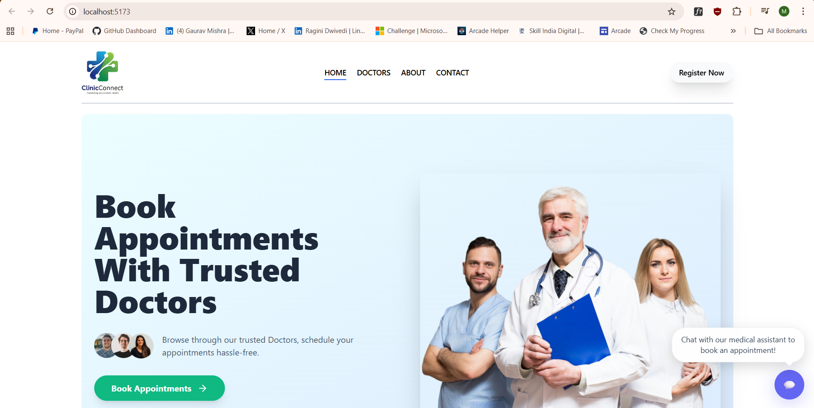
*Clean and modern landing page with doctor search functionality*

#### Doctor Search & Filtering
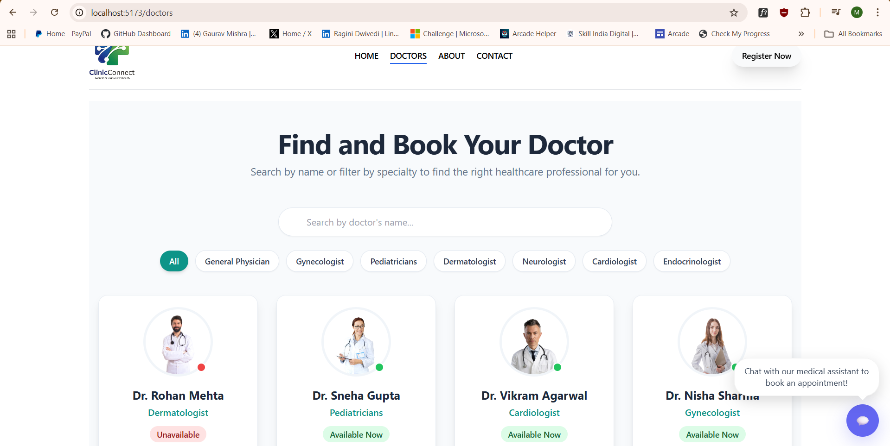
*Advanced search and filtering options for finding the right specialist*

#### Appointment Booking
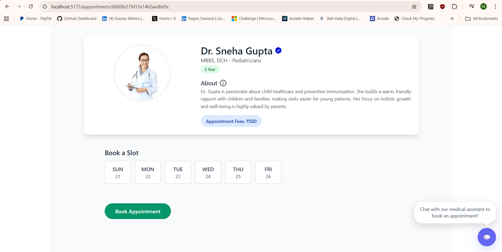
*Streamlined appointment booking process with time slot selection*

#### AI Chatbot Integration
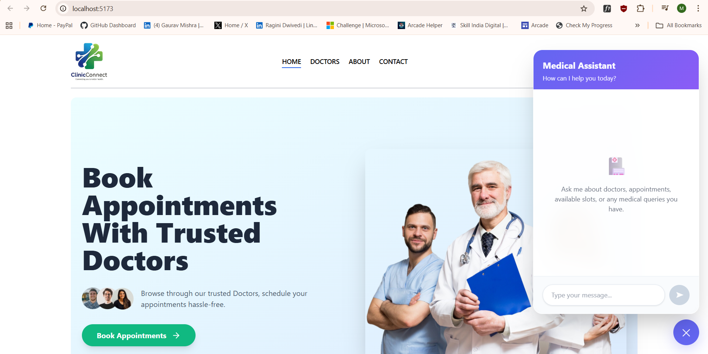
*Intelligent AI assistant powered by Google Gemini 2.0 Flash*

#### User Profile Management
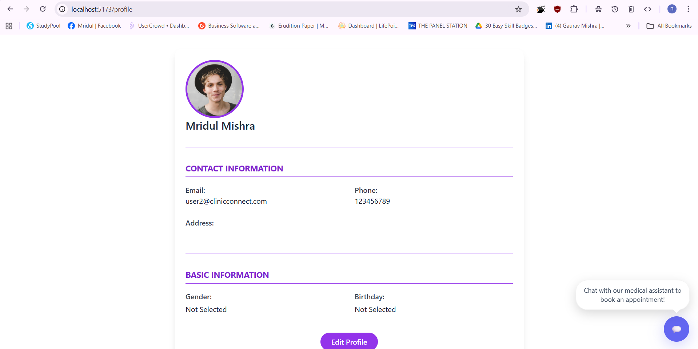
*Comprehensive profile management with medical history*

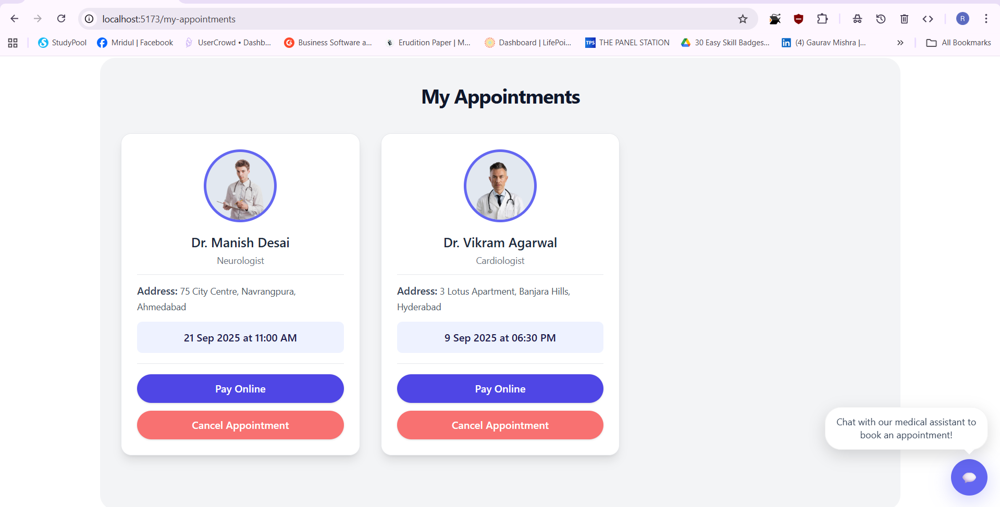

### Doctor Dashboard {#doctor-dashboard}

#### Doctor Dashboard Overview
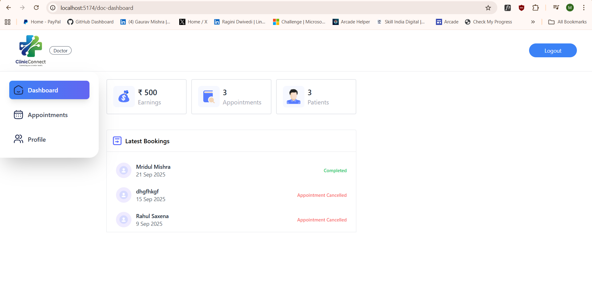
*Comprehensive dashboard showing appointments and patient data*

#### Appointment Management
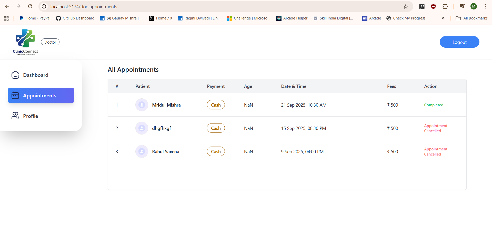
*Easy appointment management with patient details*

#### Doctor Profile Settings
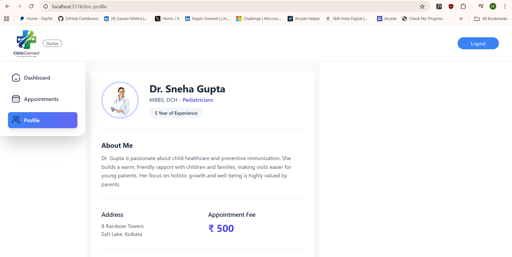
*Professional profile management for doctors*

### Admin Panel {#admin-panel}

#### Admin Dashboard
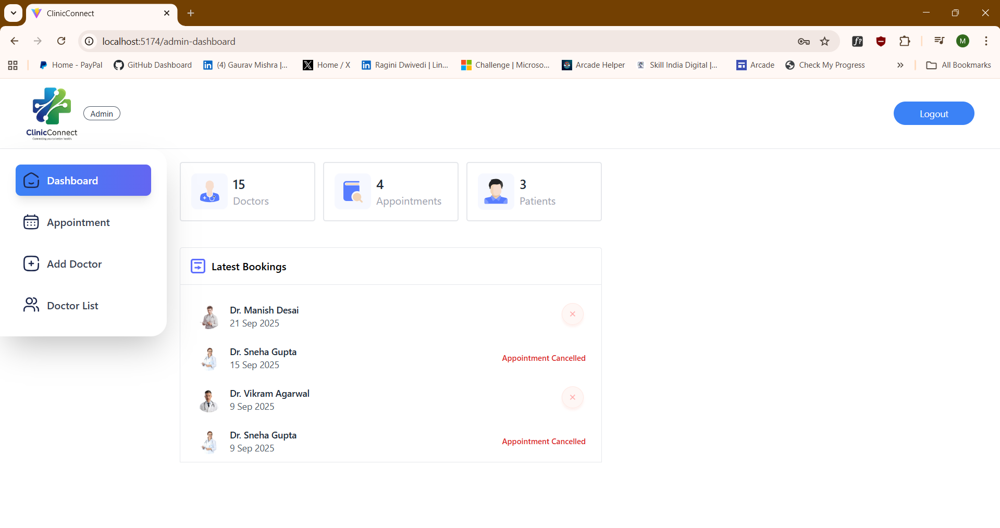
*Complete system overview with analytics and metrics*

#### Doctor Management
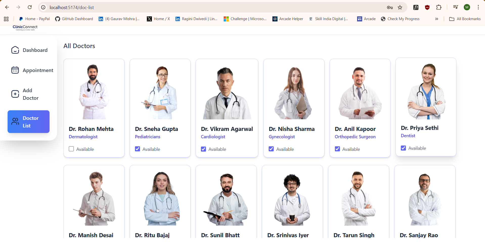
*Add, edit, and manage doctor profiles*

<div align="center">

**Made with ❤️ for better healthcare management**

[⬆ Back to Top](#-clinicconnect)

</div>